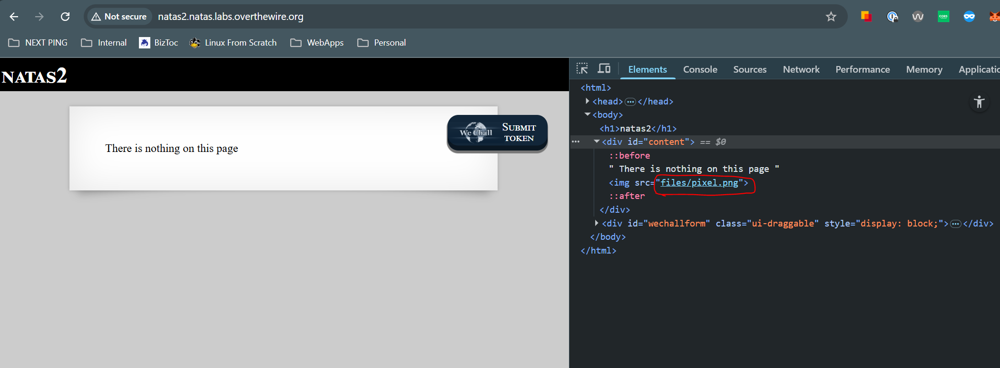
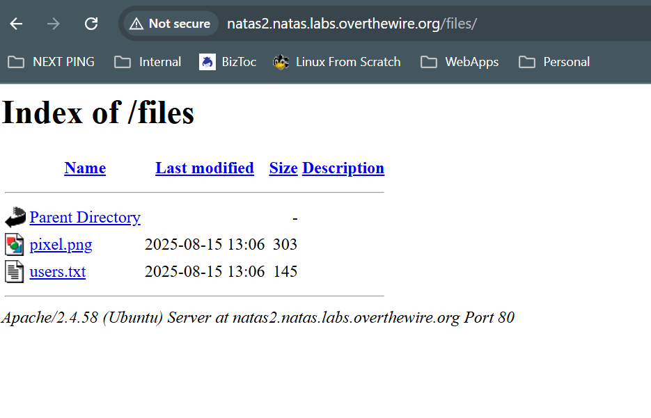
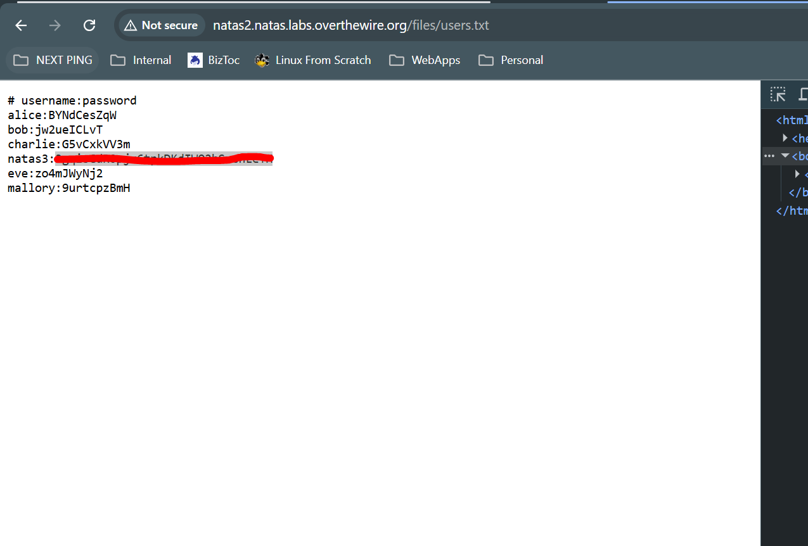

# Natas 2
## Goal
Understand the filestructure of sites/pages and how we utilize information to traverse to different areas.

## Walkthrough
When we visit the page for the second level https://natas2.natas.labs.overthewire.org, it tells us that "there is nothing on this page". When we inspect the page, we can see that there is an image hosted there whose path is at /files/pixel.png 

We can visit the pixel, but wont find anything useful ont he page. We can notice that its in a directory called `files` though, so lets visit https://natas2.natas.labs.overthewire.org 

We can see that we have access to a users.txt file the the password to the next level

## Key Takeaways
Dont allow users to traverse to areas of your web server that are unauthorized to them.

## Password
### To get to This Level

TguMNxKo1DSa1tujBLuZJnDUlCcUAPlI

### To get to Next Level

3gqisGdR0pjm6tpkDKdIWO2hSvchLeYH

