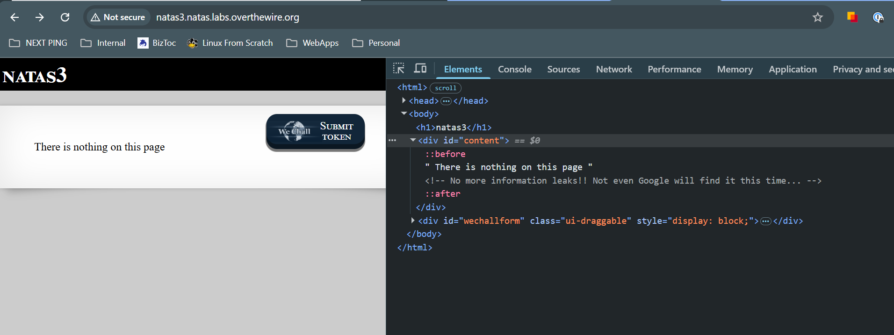
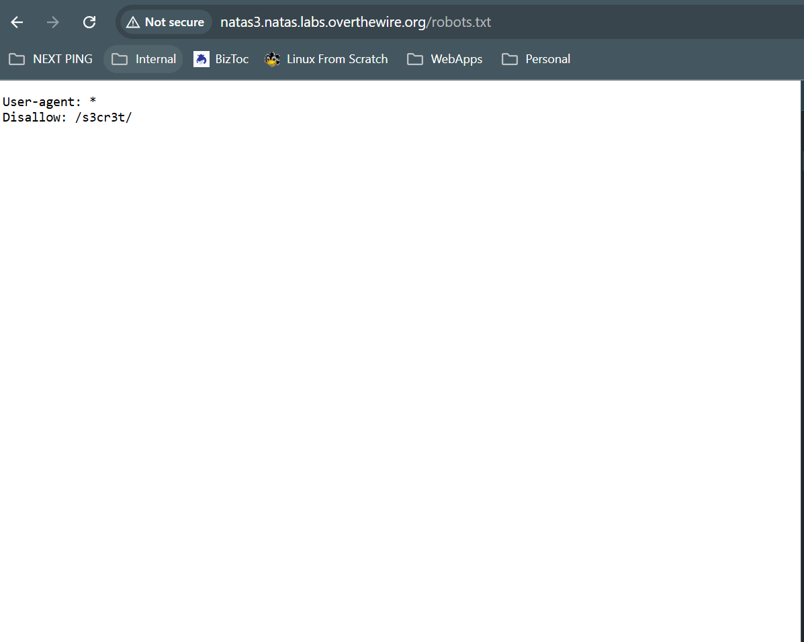
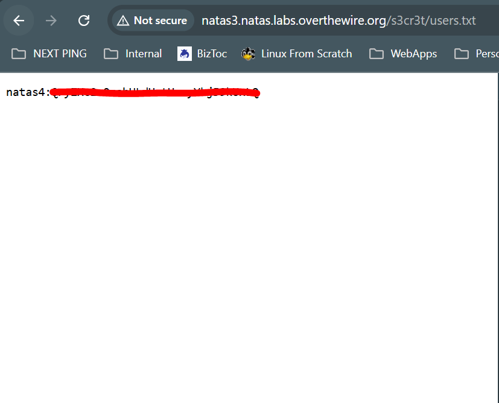

# Natas 3
## Goal
Gain an understanding of the what the robots.txt file does

## Walkthrough
When we visit the page for the second level https://natas3.natas.labs.overthewire.org, we're told again there's "nothing on this page", and upon further inspection, we're told that there are "no more information leaks" and that "not even Google will find it this time"

This is a slight hint in terms of mentioning Google "finding" something... Most sites will use a file called `robots.txt` that can tell web crawlers (a lot of them supplied by Google) what they can and can not index on the site. When we visit `robots.txt` we can see that it is disallowing crawlers to hit a folder named `s3cr3t`

We can visit the `s3cr3t` folder and see that there is anoter `users.txt` file in there

## Key Takeaways
Dont allow users to traverse to areas of your web server that are unauthorized to them.

## Password
### To get to This Level

3gqisGdR0pjm6tpkDKdIWO2hSvchLeYH

### To get to Next Level

QryZXc2e0zahULdHrtHxzyYkj59kUxLQ

