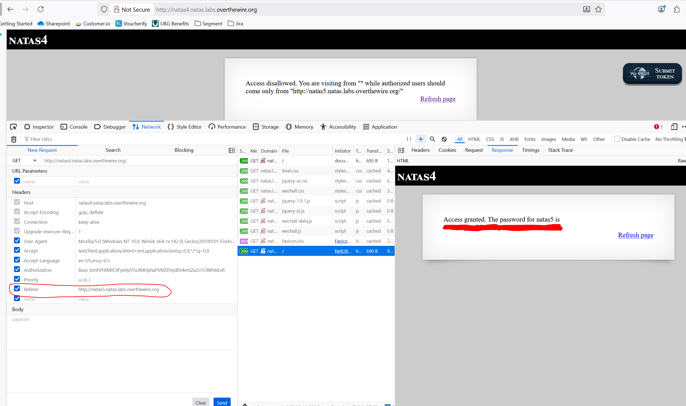

# Natas 4
## Goal
Understand how http(s) request/responses work and how they can be manipulated 

## Walkthrough
When we visit the page for level 4, we are greeted with the following message: 
> Access disallowed. You are visiting from "" while authorized users should come only from "http://natas5.natas.labs.overthewire.org/"

There are multiple ways that we can accomplish this feat. We can utilize command line tools like cURL to change our host or add a Referer header to make it seem as though we are coming from the required natas5 subdomain. We can also use proxy intercepters and repeaters like Burp to accomplish this. I went the route of using dev tools in Firefox for ease.

I began by right-clicking the request to / at the top of the network request and selected 'Edit and Resend'. From there we can easily add a new Referer header, and resend the request. Then we can view the response in the reponse tab to obtain the next password.

## Key Takeaways
Dont use origin policies as an authorization method

## Password
### To get to This Level

QryZXc2e0zahULdHrtHxzyYkj59kUxLQ

### To get to Next Level

0n35PkggAPm2zbEpOU802c0x0Msn1ToK

