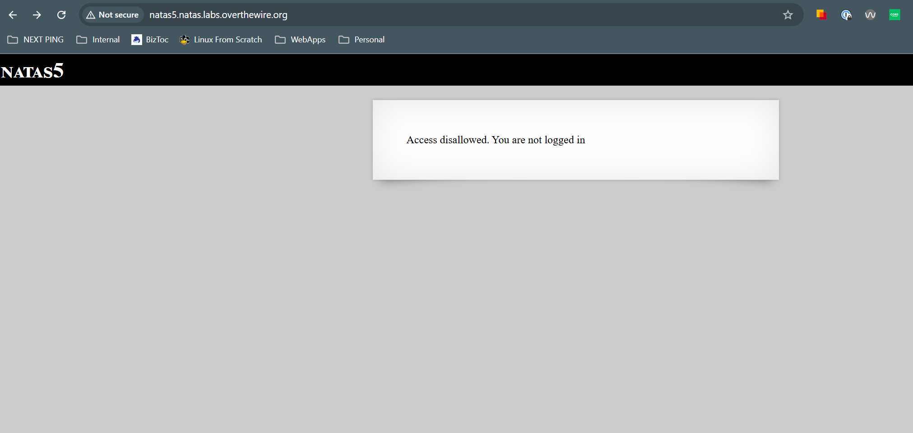
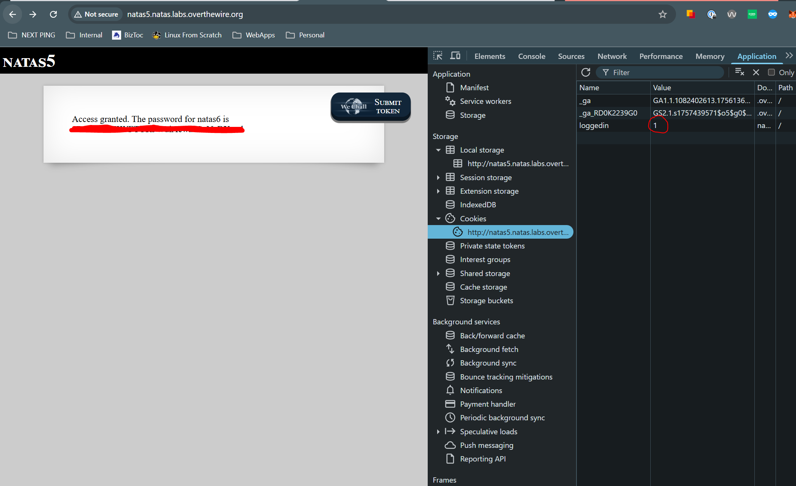

# Natas 5
## Goal
Understand how cookies work and how we can use them to our advantag
e
## Walkthrough
When we first visit the page, we are told that we can not access it as we arent logged in:

We can inspect around for any scripts, network calls, comments, source code, but nothing seems to yield much of a result. Upon inspection of our cookies however, we can see that we have a key names isLoggedIn which currently has a value set to `0`. Let's change this to a `1` and reload the page:

## Key Takeaways
Dont use cookies as an authorization method

## Password
### To get to This Level

0n35PkggAPm2zbEpOU802c0x0Msn1ToK

### To get to Next Level

0RoJwHdSKWFTYR5WuiAewauSuNaBXned

