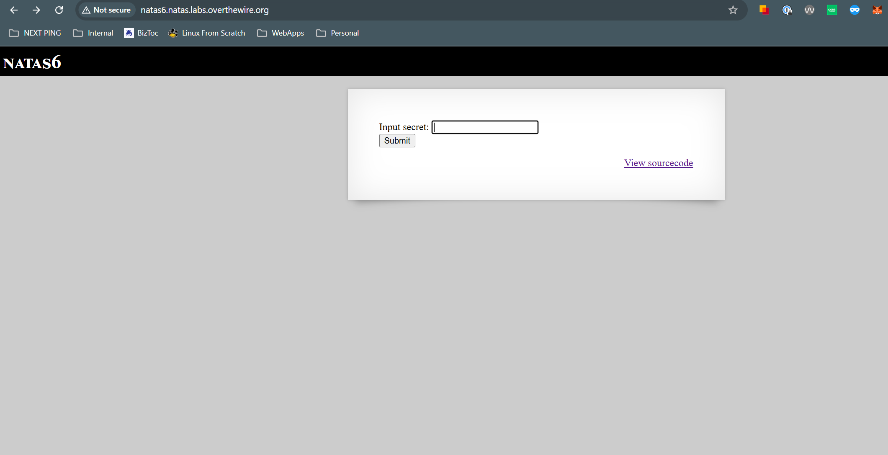
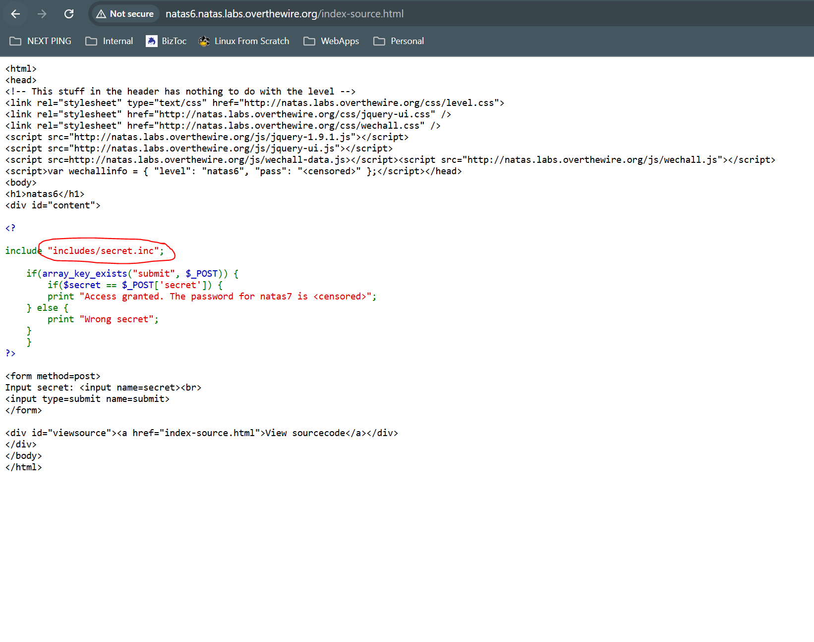
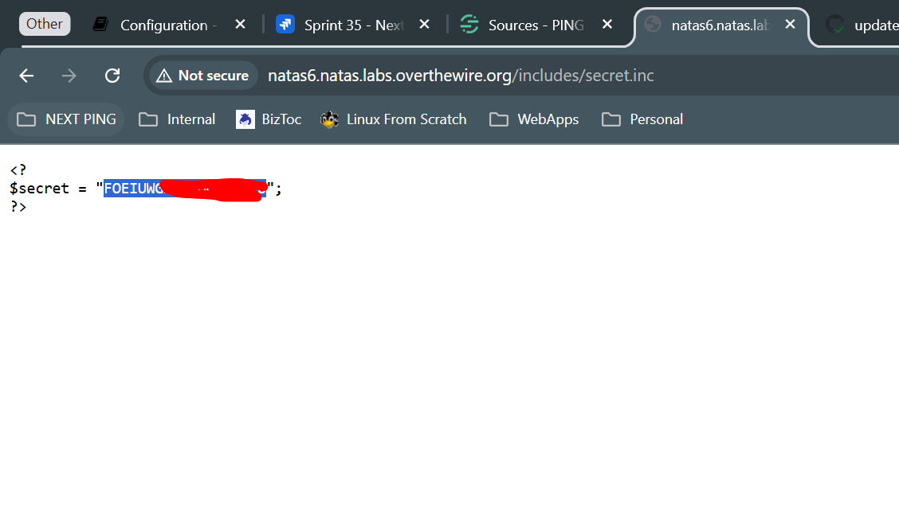
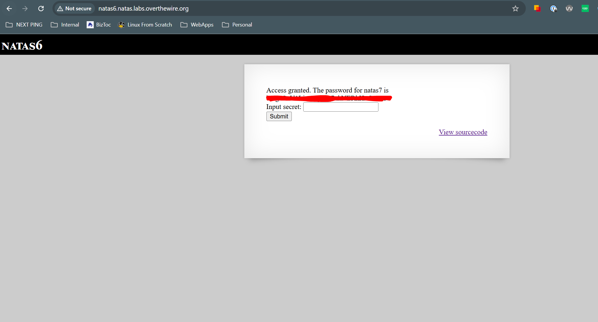

# Natas 6
## Goal
Determine secretes through keys in source code

## Walkthrough
When we first visit the page, we see an input form asking for a secret, and also a link to 'view sourcecode'

We'll take the obvious step to view the source code, and we can see that there is a js function to validate the secret which is calling upon a file at `includes/secret.inc`

We can visit that page and see that we have a secret supplied to us

When we input this into the main level page, we are granted the password to the next level

## Key Takeaways
Dont use cookies as an authorization method

## Password
### To get to This Level

0RoJwHdSKWFTYR5WuiAewauSuNaBXned

### To get to Next Level

bmg8SvU1LizuWjx3y7xkNERkHxGre0GS

