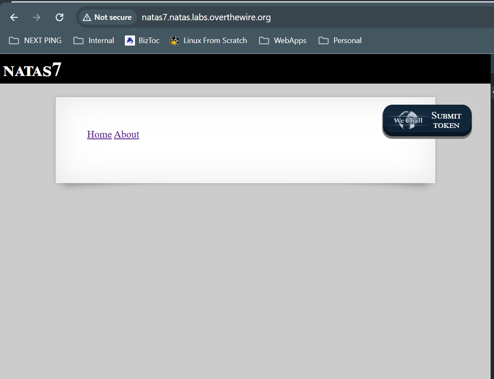
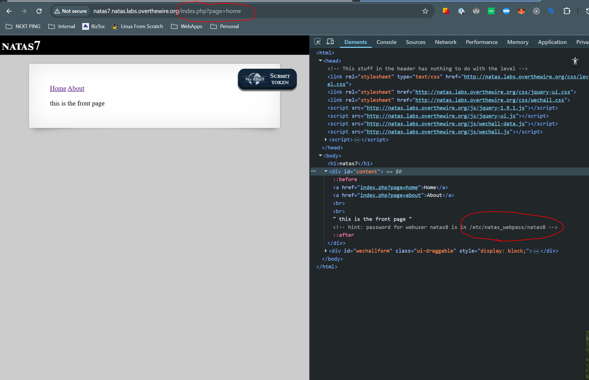
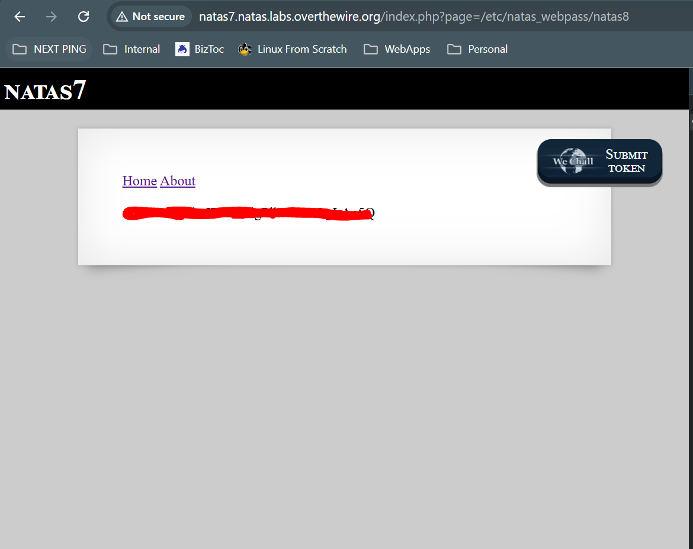

# Natas 7
## Goal
Find flag through general recon and directory traversal

## Walkthrough

When we visit the page for the site, we can see two link for Home and About

When we visit these pages, you can see that the path for the page is used as a URL paramter

You can also see in the comments where a password might be located for the next level. You'll be required to visit this page using the URL paramter method of how we visit the Home and About pages.

## Key Takeaways
URL Paramters can be risky for sites

## Password
### To get to This Level

bmg8SvU1LizuWjx3y7xkNERkHxGre0GS

### To get to Next Level

xcoXLmzMkoIP9D7hlgPlh9XD7OgLAe5Q

