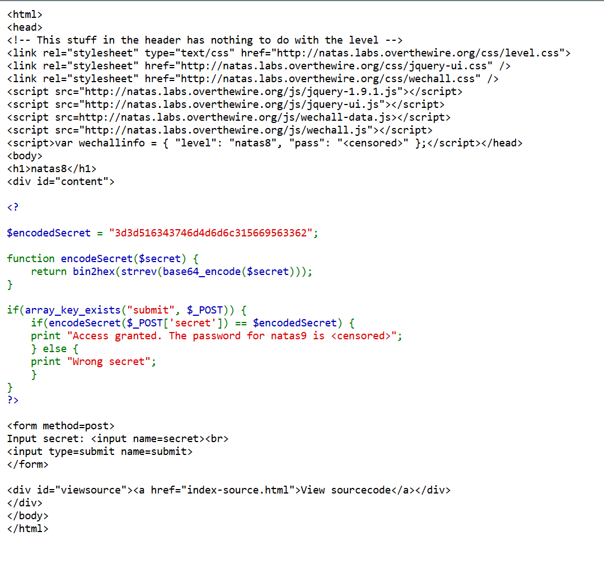
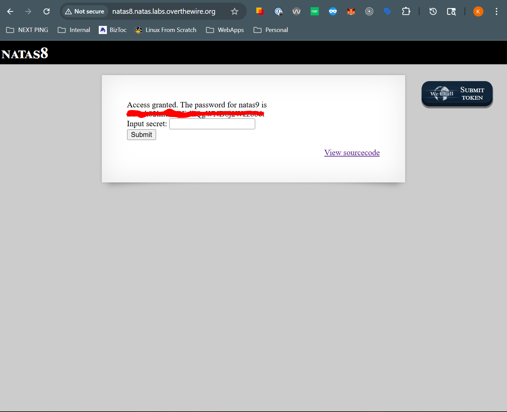

# Natas 9
## Goal
Find flag through general recon and directory traversal

## Walkthrough

This page show another input form for an input secret, and also gives us the ability to view the sourcecode again. Let's dive into the source code and see what's happening.

We can see that the page has a validate function that checks our input after some forms of manipulation. Luckily they left the encoded secret for us to reverse engineer. Take a look at whats happening in the validation check. First, we take the user input and base 64 encode it, then we reverse the string, and finally we convert the binary representation of the number to hex. After these three manipulations, we then check to see if the encoded secret is equivalent to `3d3d516343746d4d6d6c315669563362`. So let's reverse these manipulations on the encoded secret to find our input secret.

We need to take `3d3d516343746d4d6d6c315669563362` and first do a [hex2bin](https://onlinephp.io/hex2bin) manipulation on this (we went binary to hex to get here, so we need to hex to binary to get back). Then let's [reverse the result of that](https://onlinestringtools.com/reverse-string), and send it into a [base 64 *decoder*](https://www.base64decode.org/) (again we need to decode instead of encode as we are reversing the manipulations.)

Take the result and input into our secret form to obtain the password for the next level.

## Key Takeaways
URL Paramters can be risky for sites

## Password
### To get to This Level

xcoXLmzMkoIP9D7hlgPlh9XD7OgLAe5Q

### To get to Next Level

ZE1ck82lmdGIoErlhQgWND6j2Wzz6b6t

